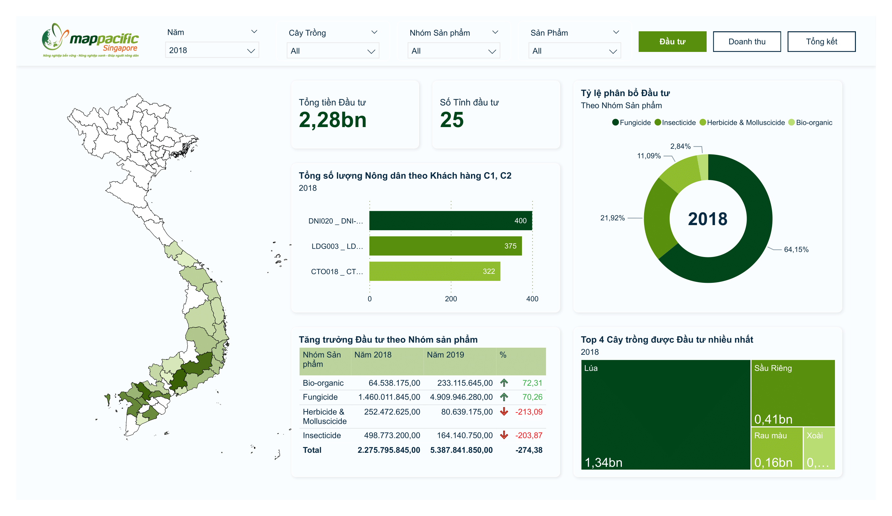

# Data Analysis Test in Map Pacific Singapore Company

## Project Overview

This project is part of a test for the Data Analyst position. The goal is to preprocess raw data, load it into SQL Server, perform SQL queries as required by the employer, and visualize the data through dashboards.

## Directory Structure

```
.
├── assets/
│   ├── MapPacificSingapore-Invest.png
│   ├── MapPacificSingapore-Revenue.png
│   └── MapPacificSingapore-Summary.png
├── data/
│   ├── raw/
│   │   └── Data Scientist-Analyst position - Requirement.xlsx
│   └── clean/
│       ├── invest_cleaned.csv
│       └── revenue_cleaned.csv
├── reports/
│   └── MapPacificSingapore.pbix
├── scripts/
│   └── MapPacificSingapore.sql
├── src/
│   ├── preprocessing.ipynb
│   └── csv_to_ssms.ipynb
└── README.md
```

## Process

### 1. Data Preprocessing

The raw data is provided in [Data Scientist-Analyst position - Requirement.xlsx](data/raw). The preprocessing steps are performed in the Jupyter notebook [preprocessing.ipynb](src), which includes:

- Cleaning and transforming the data
- Splitting the data into two CSV files: [invest_cleaned.csv](data/clean) and [revenue_cleaned.csv](data/clean)

### 2. Loading Data into SQL Server

The cleaned CSV files are loaded into SQL Server using the Jupyter notebook [csv_to_ssms.ipynb](src). This notebook contains the necessary Python code to connect to SQL Server and load the data from the CSV files.

### 3. SQL Queries

The SQL queries required by the employer are performed and saved in [MapPacificSingapore.sql](scripts). This script includes various queries to analyze the investment and revenue data.

### 4. Data Visualization

The final step involves creating dashboards to visualize the data. The Power BI report [MapPacificSingapore.pbix](reports) includes:

- Investment Dashboard:
  
  
- Revenue Dashboard:
  
  
- Summary Dashboard:
  

## Dependencies

- Python 3.x
- Jupyter Notebook
- Pandas
- SQLAlchemy
- pyodbc
- SQL Server
- Power BI Desktop

## Contact

For any questions or further information, please contact me at ngohuan18112002@gmail.com

---

I look forward to discussing this project and my approach with you. Thank you for your consideration.

Ngo Cong Huan
